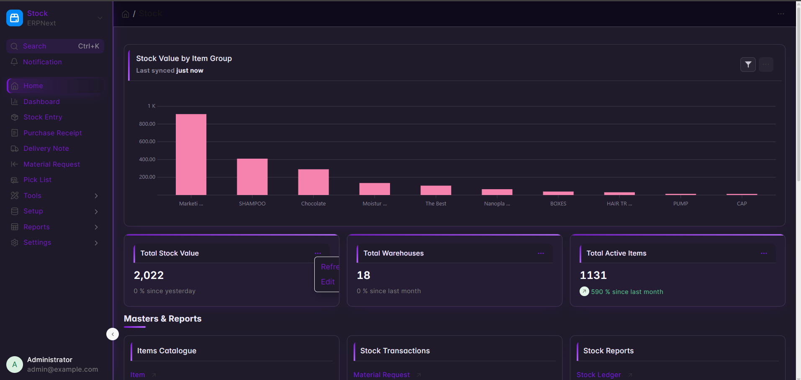
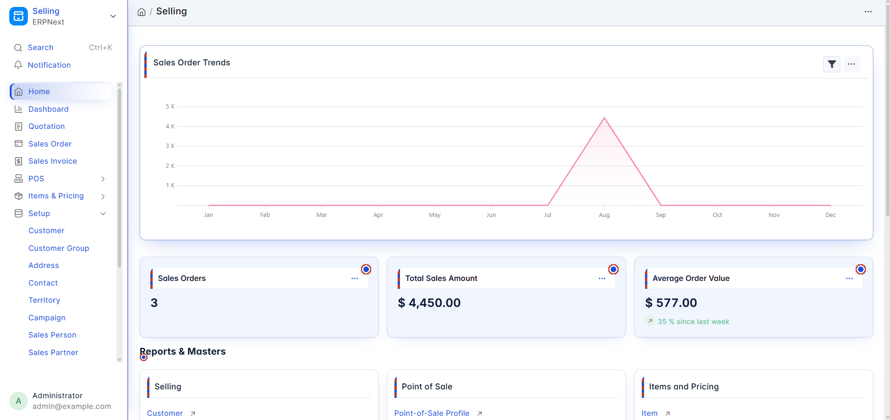
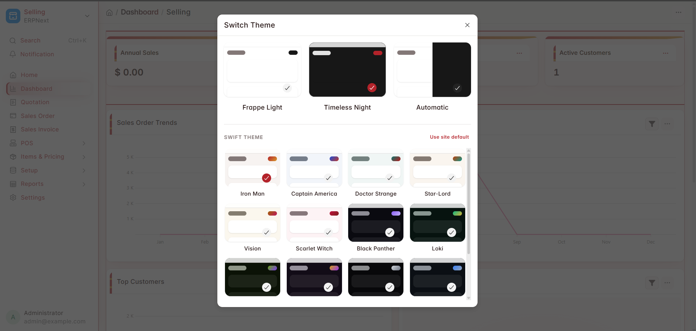
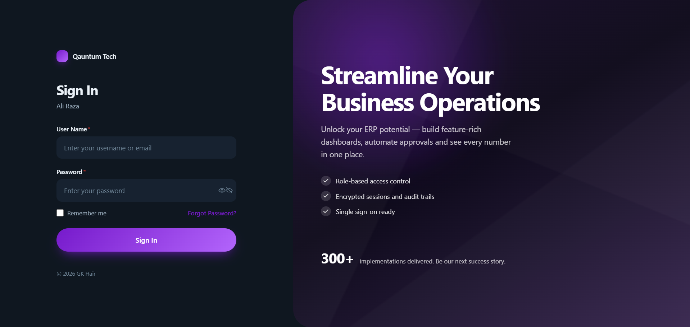
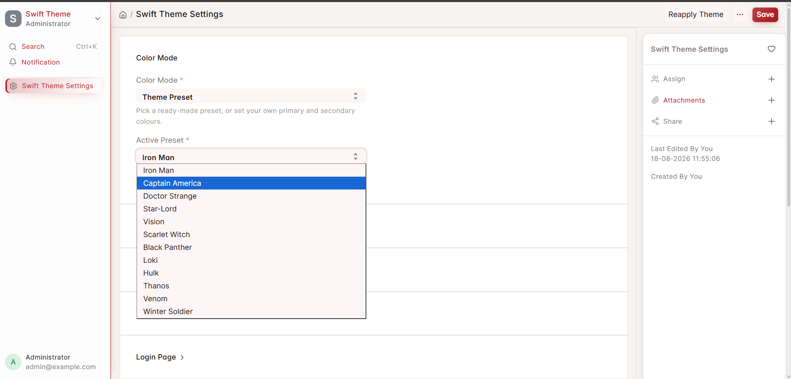
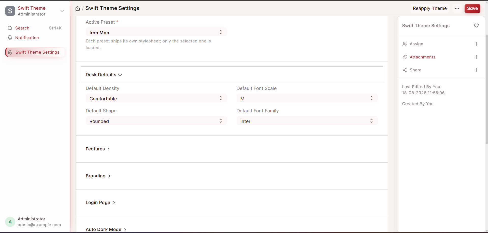
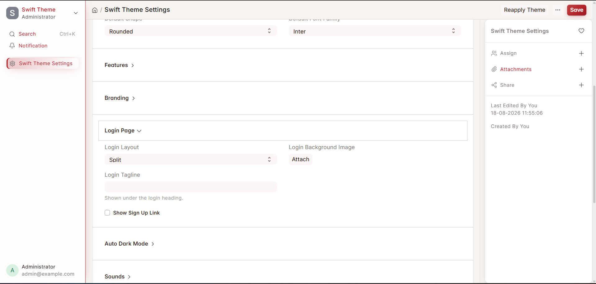

# Swift Theme

A theming layer for Frappe v16. It colours the whole desk — navbar, sidebar,
list, report, kanban, dashboards, forms, child tables, modals and the login
page — from one palette, and stays out of Frappe's way while doing it.

📖 **[Documentation](https://github.com/its-alikhokher/swift_theme/wiki)** —
installation, every setting explained, and troubleshooting.

## Themes

Twelve presets, six light and six dark, each a hand-tuned palette rather than
one hue tinting everything:

| Light | Dark |
|---|---|
| Iron Man · crimson + gold | Black Panther · violet |
| Captain America · navy + red | Loki · emerald + gold |
| Doctor Strange · teal + crimson | Hulk · lime + purple |
| Star-Lord · burnt orange + teal | Thanos · gold + purple |
| Vision · gold + magenta | Venom · monochrome |
| Scarlet Witch · rose + deep red | Winter Soldier · steel blue |

Every palette is checked against a 4.5:1 contrast floor before it ships, and
light and dark follow different rules — in dark, cards are lighter than the
page, because elevation there comes from light rather than shadow.

Each preset also brings its own **backdrop** behind the desk and its own accent
shapes on card headers and number cards, so switching preset changes more than
the hue. Two switches in Settings govern that: **Enable Backdrops** (on by
default) and **Show Backdrop Through Panels**, which makes cards and the sidebar
translucent so the background reads through the desk.

### Custom Colors

Give it a primary and a secondary colour and it works out the rest — canvas,
cards, the text for each surface, muted text, borders and accent states. Two
more choices it cannot read off a hex code:

- **Custom Mode** — Light or Dark
- **Colour Strength** — *Subtle* keeps cards neutral and puts the colour in the
  accents; *Bold* gives the cards the brand tone

If you pick a colour where neither black nor white is quite legible on it, it is
nudged a percent or two until one is.

## Switching theme

Presets appear inside Frappe's own **Switch Theme** dialog, drawn as the same
preview cards as Light / Dark / Automatic. Restricted to **Administrator** and
**System Manager**, enforced on the server rather than only hidden in the UI.

**Enable Theme Switcher** governs all three places a theme can be changed — the
navbar chip, that dialog, and the command palette.

Saving Swift Theme Settings applies immediately in every open desk session.

## Also included

- **Login page** in three layouts (Split, Centered, Minimal), themed from the
  active palette and rendered server-side so it paints correctly on first load
- **Density, shape, font scale and family**, per user
- **Sounds** on desk events, configurable per event — no audio ships, so an
  event with no file attached keeps Frappe's own sound
- **Focus / reading mode**, a command palette, and a hide-the-sidebar toggle on
  Alt+B

No images are shipped for any of the theming: it is CSS plus one inline SVG,
so there is nothing extra to download.

## Screenshots

The same workspace in a light palette — Captain America:

All twelve presets sit inside Frappe's own Switch Theme dialog, drawn as the
same preview cards as Light / Dark / Automatic:

The login page, Split layout, themed from the same palette:

Everything is configured from one place — the preset, the desk defaults every
user inherits, and the login page:

| | | |
|---|---|---|
|  |  |  |

## Requirements

Frappe **v16** (`>=16.0.0,<17.0.0`) and Python 3.10 or newer.

Setup steps are in the
[wiki](https://github.com/its-alikhokher/swift_theme/wiki/Installation), which
also covers upgrading and uninstalling.

## Upgrading

Upgrades carry the site across on their own — nothing needs setting by hand.
The presets were renamed along the way, so a site that was on *Midnight Pro*
comes back as **Black Panther**; the full mapping is in
`patches/v1_0/rename_presets_to_marvel.py`.

## Contributing

[CONTRIBUTING.md](CONTRIBUTING.md) covers setup, the test suites, and the CSS
rules that exist because breaking them broke something real. Please report
security problems privately — see [SECURITY.md](SECURITY.md). Everyone taking
part is expected to follow the [Code of Conduct](CODE_OF_CONDUCT.md).

[REQUIREMENT.md](REQUIREMENT.md) records what the app is meant to do, including
the constraints that exist because something broke, and the
[wiki](https://github.com/its-alikhokher/swift_theme/wiki) is the user-facing
documentation.

## Licence

MIT
